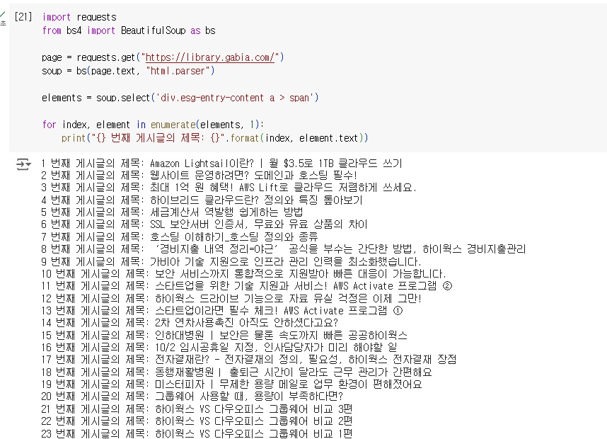
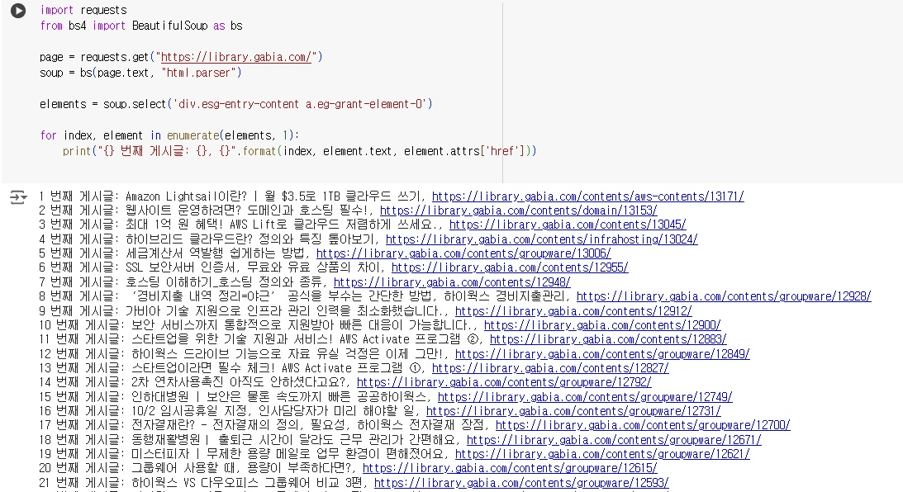
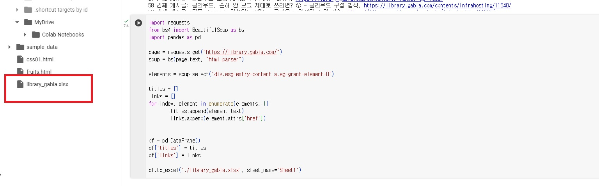
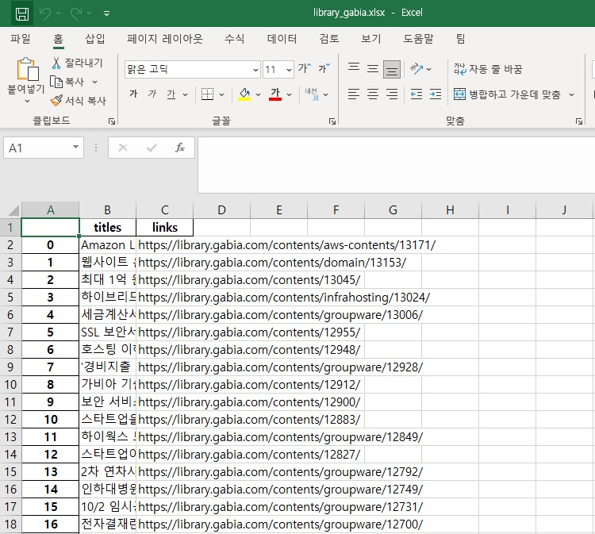

```python
# 과제
import requests
from bs4 import BeautifulSoup as bs

page = requests.get("https://library.gabia.com/")
soup = bs(page.text, "html.parser")

elements = soup.select('div.esg-entry-content a > span')

for index, element in enumerate(elements, 1):
		print("{} 번째 게시글의 제목: {}".format(index, element.text))
```
# 결과
<p align="left">
 
</p>

```python
import requests
from bs4 import BeautifulSoup as bs

page = requests.get("https://library.gabia.com/")
soup = bs(page.text, "html.parser")

elements = soup.select('div.esg-entry-content a.eg-grant-element-0')

for index, element in enumerate(elements, 1):
		print("{} 번째 게시글: {}, {}".format(index, element.text, element.attrs['href']))
```
# 결과
<p align="left">
 
</p>

```python
import requests
from bs4 import BeautifulSoup as bs
import pandas as pd

page = requests.get("https://library.gabia.com/")
soup = bs(page.text, "html.parser")

elements = soup.select('div.esg-entry-content a.eg-grant-element-0')

titles = []
links = []
for index, element in enumerate(elements, 1):
        titles.append(element.text)
        links.append(element.attrs['href'])


df = pd.DataFrame()
df['titles'] = titles
df['links'] = links

df.to_excel('./library_gabia.xlsx', sheet_name='Sheet1')
```
# 결과
<p align="left">
 
</p>

# 엑셀파일
<p align="left">
 
</p>
