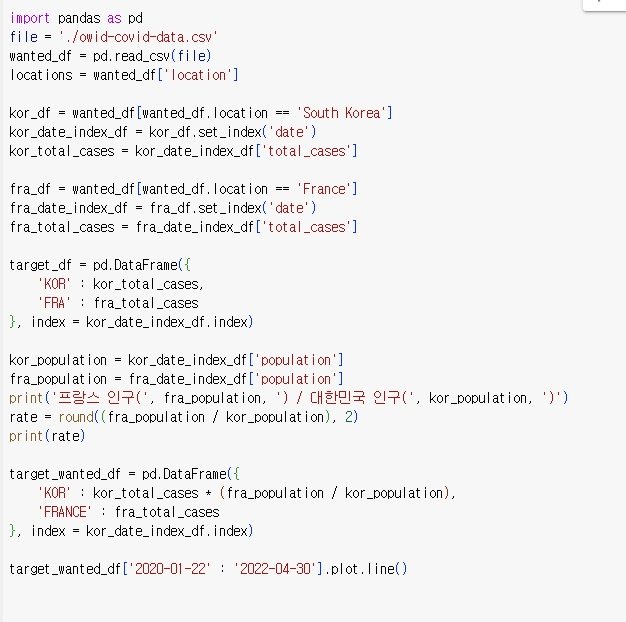
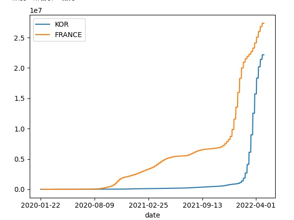

```python
# 과제
import pandas as pd
file = './owid-covid-data.csv'
wanted_df = pd.read_csv(file)
locations = wanted_df['location']

kor_df = wanted_df[wanted_df.location == 'South Korea']
kor_date_index_df = kor_df.set_index('date')
kor_total_cases = kor_date_index_df['total_cases']

fra_df = wanted_df[wanted_df.location == 'France']
fra_date_index_df = fra_df.set_index('date')
fra_total_cases = fra_date_index_df['total_cases']

target_df = pd.DataFrame({
    'KOR' : kor_total_cases,
    'FRA' : fra_total_cases
}, index = kor_date_index_df.index)

kor_population = kor_date_index_df['population']
fra_population = fra_date_index_df['population']
print('프랑스 인구(', fra_population, ') / 대한민국 인구(', kor_population, ')')
rate = round((fra_population / kor_population), 2)
print(rate)

target_wanted_df = pd.DataFrame({
    'KOR' : kor_total_cases * (fra_population / kor_population),
    'FRANCE' : fra_total_cases
}, index = kor_date_index_df.index)

target_wanted_df['2020-01-22' : '2022-04-30'].plot.line()
```
# 결과
<p align="left">
 

</p>
