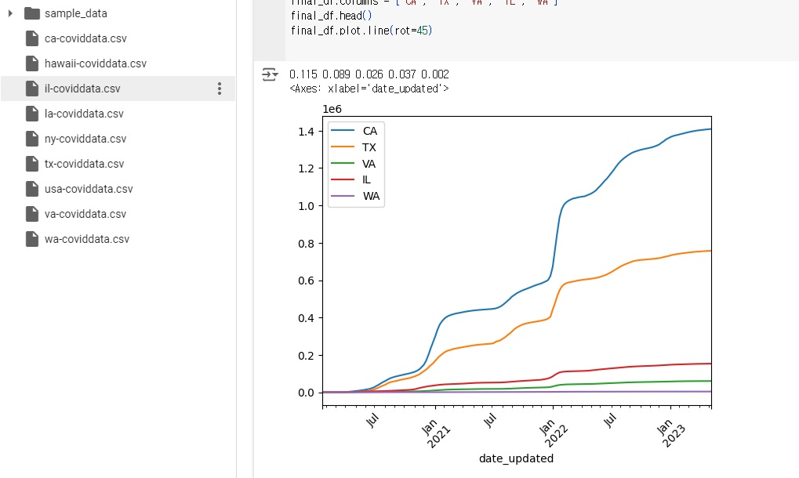

```python
# 과제
import pandas as pd

raw_ca_df = pd.read_csv('./ca-coviddata.csv')
ca_total_cases = raw_ca_df[['tot_cases', 'date_updated']]
ca_dateindex_df = ca_total_cases.set_index('date_updated')

raw_tx_df = pd.read_csv('./tx-coviddata.csv')
tx_total_cases = raw_tx_df[['tot_cases', 'date_updated']]
tx_dateindex_df = tx_total_cases.set_index('date_updated')

raw_va_df = pd.read_csv('./va-coviddata.csv')
va_total_cases = raw_va_df[['tot_cases', 'date_updated']]
va_dateindex_df = va_total_cases.set_index('date_updated')

raw_il_df = pd.read_csv('./il-coviddata.csv')
il_total_cases = raw_il_df[['tot_cases', 'date_updated']]
il_dateindex_df = il_total_cases.set_index('date_updated')

raw_wa_df = pd.read_csv('./wa-coviddata.csv')
wa_total_cases = raw_wa_df[['tot_cases', 'date_updated']]
wa_dateindex_df = wa_total_cases.set_index('date_updated')

ca_population = 39_030_000
tx_population = 30_030_000
va_population = 8_684_000
il_population = 12_580_000
wa_population = 671_803
USA_population = 338_289_856

ca_rate = round((ca_population / USA_population), 3)
tx_rate = round((tx_population / USA_population), 3)
va_rate = round((va_population / USA_population), 3)
il_rate = round((il_population / USA_population), 3)
wa_rate = round((wa_population / USA_population), 3)
print(ca_rate, tx_rate, va_rate, il_rate, wa_rate)

ca_dateindex_df.index = pd.to_datetime(ca_dateindex_df.index)
tx_dateindex_df.index = pd.to_datetime(tx_dateindex_df.index)
va_dateindex_df.index = pd.to_datetime(va_dateindex_df.index)
il_dateindex_df.index = pd.to_datetime(il_dateindex_df.index)
wa_dateindex_df.index = pd.to_datetime(wa_dateindex_df.index)

ca_dateindex_df.sort_index(ascending=True, inplace=True)
tx_dateindex_df.sort_index(ascending=True, inplace=True)
va_dateindex_df.sort_index(ascending=True, inplace=True)
il_dateindex_df.sort_index(ascending=True, inplace=True)
wa_dateindex_df.sort_index(ascending=True, inplace=True)

# print(ca_dateindex_df.head())
# print(tx_dateindex_df.head())
# print(va_dateindex_df.head())
# print(il_dateindex_df.head())
# print(wa_dateindex_df.head())

final_df = pd.concat([ca_dateindex_df * ca_rate,
                      tx_dateindex_df * tx_rate,
                      va_dateindex_df * va_rate,
                      il_dateindex_df * il_rate,
                      wa_dateindex_df * wa_rate], axis=1)
final_df.columns = ['CA', 'TX', 'VA', 'IL', 'WA']
final_df.head()
final_df.plot.line(rot=45)
```
# 결과
<p align="left">
 
</p>
