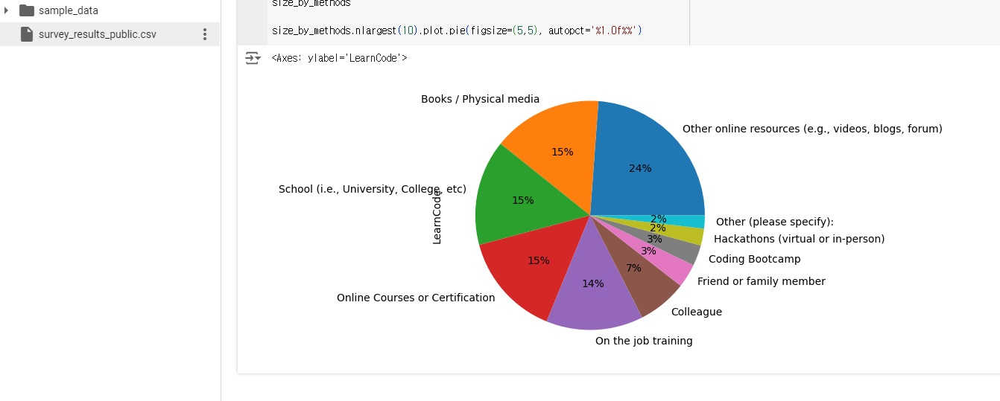

```python
# 과제
import pandas as pd
raw_data = pd.read_csv('./survey_results_public.csv')
# raw_data.info()

target_data = raw_data[['Age','Country', 'LanguageHaveWorkedWith', 'LearnCode']]
# target_data.head()

size_by_LearnCode = target_data.groupby('LearnCode').size()
# size_by_LearnCode

methods = target_data['LearnCode']
# methods

methods = methods.str.split(';')
# methods

exploded_methods = methods.explode()
# exploded_methods

size_by_methods = exploded_methods.groupby(exploded_methods).size()
size_by_methods

size_by_methods.nlargest(10).plot.pie(figsize=(5,5), autopct='%1.0f%%')
```
# 결과
<p align="left">
 
</p>
