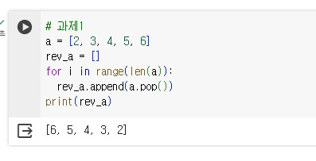

```python
# 과제1
a = [2, 3, 4, 5, 6]
rev_a = []
for i in range(len(a)):
  rev_a.append(a.pop())
print(rev_a)
```

<p align="left">
 
</p>

```python
# 과제2
a = (1, 2, 5, 4, 3, 2, 1, 4, 7, 8, 9, 9, 3, 7, 3)
result = [0 for i in range(0, 10)]
max_count = 0
max_num = 0
for num in a:
  result[num] += 1

for i in range(len(result)):
  if max_count <= result[i]:
    max_count = result[i]
    max_num = i

print("주어진 튜플은 : {}".format(a))
print("가장 많이 나타나는 원소는: {}".format(max_num))

a = (1, 2, 5, 4, 3, 2, 9, 4, 7, 8, 9, 9, 3, 7, 3)
result = [0 for i in range(0, 10)]
max_count = 0
max_num = 0
for num in a:
  result[num] += 1

for i in range(len(result)):
  if max_count <= result[i]:
    max_count = result[i]
    max_num = i

print("주어진 튜플은 : {}".format(a))
print("가장 많이 나타나는 원소는: {}".format(max_num))
```

<p align="left">
 
</p>

```python
# 과제3-1
menu = {"Americano" : 3000, "Ice Americano" : 3500, "Cappucino" : 4000, "Cafe Latte" : 4500, "Espresso" : 3600}
for key in menu:
  print("{:16s}가격 : {:,}원 ".format(key, menu[key]))
```

<p align="left">
 
</p>

```python
# 과제3-2
menu = {"Americano" : 3000, "Ice Americano" : 3500, "Cappucino" : 4000, "Cafe Latte" : 4500, "Espresso" : 3600}
for key in menu:
  print("{:16s}가격 : {:,}원 ".format(key, menu[key]))
choice = input("위의 메뉴중 하나를 선택하세요: ")

if choice in menu.keys():
  print("{}는 {:,}원 입니다. 결제를 부탁합니다.".format(choice, menu[choice]))
else:
  print("미안합니다. {}는 메뉴에 없습니다".format(choice))
```

<p align="left">
 
</p>
