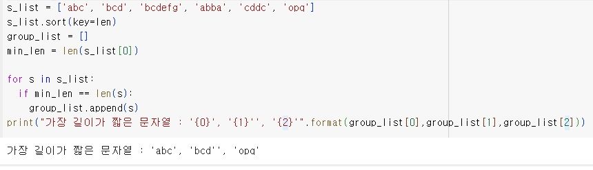

```python
# 과제1-1
a = (1, 2, 5, 4, 3, 2, 1, 4, 7, 8, 9, 9, 3, 7, 3)
result = [0 for i in range(0, 10)]
max_count = 0
max_num = 0
for num in a:
  result[num] += 1

for i in range(len(result)):
  if max_count <= result[i]:
    max_count = result[i]
    max_num = i

print("주어진 튜플은 : {}".format(a))
print("가장 많이 나타나는 원소는: {}".format(max_num))

a = (1, 2, 5, 4, 3, 2, 9, 4, 7, 8, 9, 9, 3, 7, 3)
result = [0 for i in range(0, 10)]
max_count = 0
max_num = 0
for num in a:
  result[num] += 1

for i in range(len(result)):
  if max_count <= result[i]:
    max_count = result[i]
    max_num = i

print("주어진 튜플은 : {}".format(a))
print("가장 많이 나타나는 원소는: {}".format(max_num))
```
# 결과
<p align="left">
 
</p>

```python
# 과제1-2
sales = (100, 121, 120, 130, 140, 120, 122, 123, 190, 125)
drop = 0

for i in range(len(sales) - 1):
  if sales[i] > sales[i+1]:
    drop += 1
print('일일 매출 기록 : ', sales)
print('지난 {0}일 동안 전일대비 매출이 감소한 날은 {1}일입니다.'.format(len(sales), drop))
```
# 결과
<p align="left">
 
</p>

```python
# 과제2-1
menu = {"Americano" : 3000, "Ice Americano" : 3500, "Cappucino" : 4000, "Cafe Latte" : 4500, "Espresso" : 3600}
for key in menu:
  print("{:16s}가격 : {:,}원 ".format(key, menu[key]))
```
# 결과
<p align="left">
 
</p>

```python
# 과제2-2
menu = {"Americano" : 3000, "Ice Americano" : 3500, "Cappucino" : 4000, "Cafe Latte" : 4500, "Espresso" : 3600}
for key in menu:
  print("{:16s}가격 : {:,}원 ".format(key, menu[key]))
choice = input("위의 메뉴중 하나를 선택하세요: ")

if choice in menu.keys():
  print("{}는 {:,}원 입니다. 결제를 부탁합니다.".format(choice, menu[choice]))
else:
  print("미안합니다. {}는 메뉴에 없습니다".format(choice))
```
# 결과
<p align="left">
 
</p>

```python
# 과제3-1
s_list = ['abc', 'bcd', 'bcdefg', 'abba', 'cddc', 'opq']
min_len = len(s_list[0]);
min_s = s_list[0]
for s in s_list:
  l = len(s)
  if min_len > l:
    min_len = l
    min_s = s
print('가장 길이가 짧은 문자열 :', min_s)
```
# 결과
<p align="left">
 
</p>

```python
# 과제3-2
s_list = ['abc', 'bcd', 'bcdefg', 'abba', 'cddc', 'opq']
s_list.sort(key=len)
group_list = []
min_len = len(s_list[0])

for s in s_list:
  if min_len == len(s):
    group_list.append(s)
print("가장 길이가 짧은 문자열 : '{0}', '{1}'', '{2}'".format(group_list[0],group_list[1],group_list[2]))
```
# 결과
<p align="left">
 
</p>
