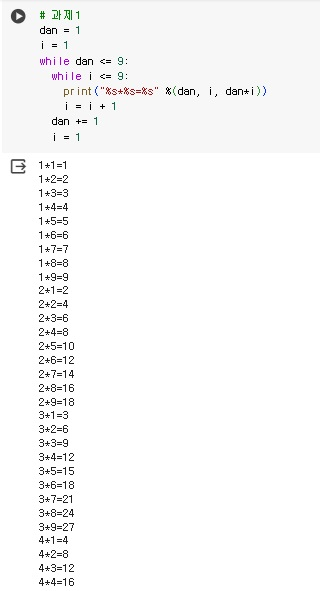
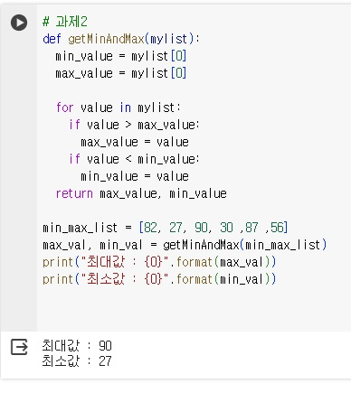

```python
# 과제1
dan = 1
i = 1
while dan <= 9:
  while i <= 9:
    print("%s*%s=%s" %(dan, i, dan*i))
    i = i + 1
  dan += 1
  i = 1
```
# 결과
<p align="left">
 
</p>

```python
# 과제2
def getMinAndMax(mylist):
  min_value = mylist[0]
  max_value = mylist[0]

  for value in mylist:
    if value > max_value:
      max_value = value
    if value < min_value:
      min_value = value
  return max_value, min_value

min_max_list = [82, 27, 90, 30 ,87 ,56]
max_val, min_val = getMinAndMax(min_max_list)
print("최대값 : {0}".format(max_val))
print("최소값 : {0}".format(min_val))
```
# 결과
<p align="left">
 
</p>
