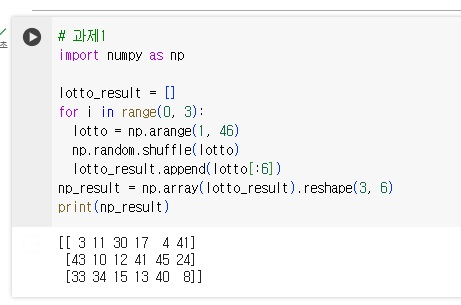
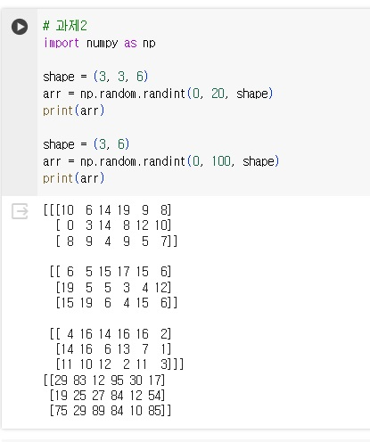
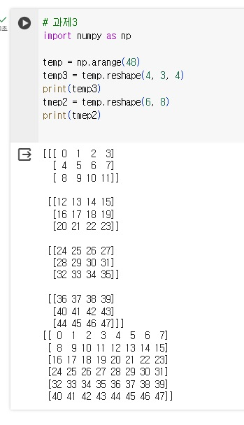

```python
# 과제1
import numpy as np

lotto_result = []
for i in range(0, 3):
  lotto = np.arange(1, 46)
  np.random.shuffle(lotto)
  lotto_result.append(lotto[:6])
np_result = np.array(lotto_result).reshape(3, 6)
print(np_result)
```
# 결과
<p align="left">
 
</p>

```python
# 과제2
import numpy as np

shape = (3, 3, 6)
arr = np.random.randint(0, 20, shape)
print(arr)

shape = (3, 6)
arr = np.random.randint(0, 100, shape)
print(arr)
```
# 결과
<p align="left">
 
</p>

```python
# 과제3
import numpy as np

temp = np.arange(48)
temp3 = temp.reshape(4, 3, 4)
print(temp3)
tmep2 = temp.reshape(6, 8)
print(tmep2)
```
# 결과
<p align="left">
 
</p>
