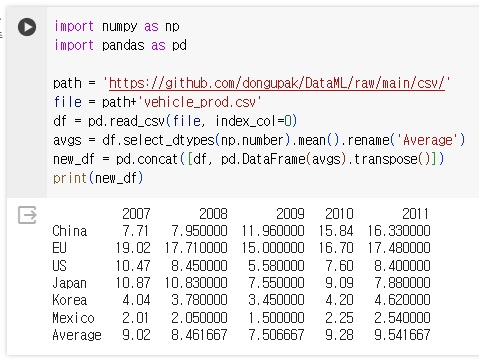

```python
# 과제1
import numpy as np
import pandas as pd

path = 'https://github.com/dongupak/DataML/raw/main/csv/'
file = path+'vehicle_prod.csv'
df = pd.read_csv(file, index_col=0)
avgs = df.select_dtypes(np.number).mean().rename('Average')
new_df = pd.concat([df, pd.DataFrame(avgs).transpose()])
print(new_df)
```
# 결과
<p align="left">
 
</p>

```python
