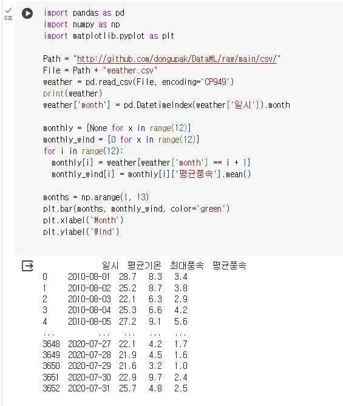

```python
# 과제1
import matplotlib.pyplot as plt
import numpy as np
import pandas as pd

Path = "http://github.com/dongupak/DataML/raw/main/csv/"
File = Path + "weather.csv"
weather = pd.read_csv(File, encoding='CP949')
print(weather)
weather['month'] = pd.DatetimeIndex(weather['일시']).month

monthly = [None for x in range(12)]
monthly_wind = [0 for x in range(12)]
for i in range(12):
  monthly[i] = weather[weather['month'] == i + 1]
  monthly_wind[i] = monthly[i]['평균풍속'].mean()

months = np.arange(1, 13)
plt.bar(months, monthly_wind, color='green')
plt.xlabel('Month')
plt.ylabel('Wind')
plt.show()
```
# 결과
<p align="left">
 
  
</p>

```python
