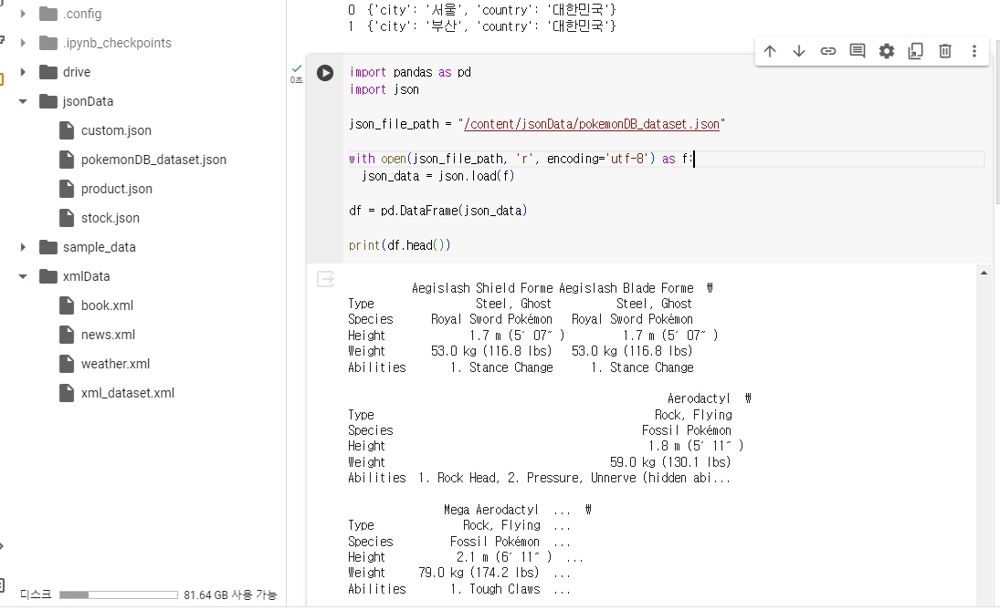
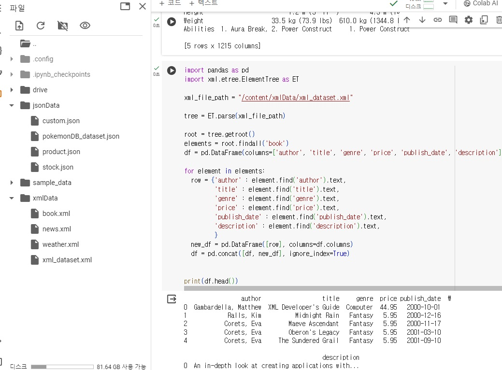

```python
# 과제1
import pandas as pd
import json

json_file_path = "/content/jsonData/pokemonDB_dataset.json"

with open(json_file_path, 'r', encoding='utf-8') as f:
  json_data = json.load(f)

df = pd.DataFrame(json_data)

print(df.head())
```
# 결과
<p align="left">
 
</p>

```python
# 과제2
import pandas as pd
import xml.etree.ElementTree as ET

xml_file_path = "/content/xmlData/xml_dataset.xml"

tree = ET.parse(xml_file_path)

root = tree.getroot()
elements = root.findall('book')
df = pd.DataFrame(columns=['author', 'title', 'genre', 'price', 'publish_date', 'description'])

for element in elements:
  row = {'author' : element.find('author').text,
         'title' : element.find('title').text,
         'genre' : element.find('genre').text,
         'price' : element.find('price').text,
         'publish_date' : element.find('publish_date').text,
         'description' : element.find('description').text,
         }
  new_df = pd.DataFrame([row], columns=df.columns)
  df = pd.concat([df, new_df], ignore_index=True)


print(df.head())
```
# 결과
<p align="left">
 
</p>
